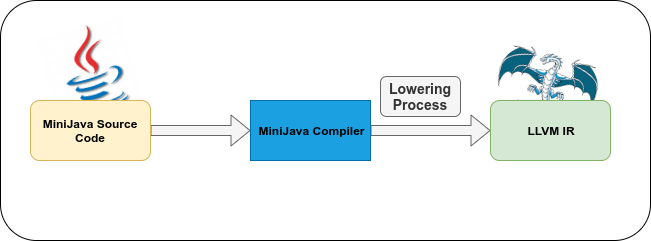

# MiniJava Lowering to LLVM IR
<p align="center">
  
</p>
<br />Part of MiniJava Compiler performing Lowering generating LLVM Intermediate Representation. After semantically checked, the code in Minijava is lowered to LLVM Intermediate Represenation using a visitor pattern. LLVM Language Reference Manual can be found here: https://llvm.org/docs/LangRef.html#instruction-reference. The V-Table of classes is created based on the offsets generated from the program here: www.github.com/AndCharalampous/minijava-semantic-check.

## Language Specifications
Language Specifications can be viewed [here](minijava_specs.txt)
<br />Also the minijava grammar in BNF can be found [here](minijava_bnf.html)

## Deployment

The code was developed and tested on **Linux Ubuntu 18.04 LTS** using **openJDK and javac v11.0.4**.

## Prerequisites

A Linux distribution is required with a version of JDK and JRE. 
<br />You can check your jdk and jre version using:
<br />``` $ java -version ```
<br />``` $ javac -version ```

You can install the latest JDK and JRE version on Ubuntu based systems using:
<br />``` $ sudo apt install default-jre ```
<br />``` $ sudo apt install default-jdk ```
<br />Also Clang v4 or older is needed in order to run the output of the lowering process. You can install using:
<br /```  $ sudo apt install clang-4.0```


## Getting Started
Download Repository Locally using:
<br /> ```$ git clone https://github.com/AndCharalampous/minijava-lowering.git ```

## Compilation
Compile code using the Makefile provided:
<br /> ```$ cd src```
<br /> ```$ make```
<br /> Java main file is created.

### Execution
Execute using:
<br /> ```java Main [javaf1 javaf2 .. javafN]```
* Main: MiniJava Lowering Compiler Main file
* javaf#: MiniJava File that will be semantically checked
_At least one MiniJava file must be provided._

### Output
After completion, for every valid input a corresponding .ll file will be created.
<br />You can then compile that .ll file, producing an executable. For example, if file1.java was given for execution, a file1.ll file will be created. It can then be compiled with clang and executed.
<br /> ```$ clang-4.0 -o file1.x file1.ll```
<br /> ```$ ./file1.x```


## Author
**Andreas Charalampous** - https://github.com/AndCharalampous

## License

This project is licensed under the MIT License - see the [LICENSE.md](LICENSE.md) file for details
